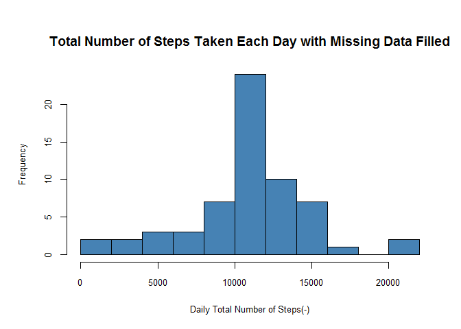

# Reproducible Research: Peer Assessment 1


## Loading and preprocessing the data

The following code read in the data from the current working directory, changes the 
*date* column data format from a factor to a date format, and saves the date in two 
data.frame variables: *mydataRaw* and *mydata* for later use.


```r
        maindir <- "."
        setwd(maindir)
        mydataRaw <- read.csv("./activity.csv", sep=",", header = TRUE)
        mydataRaw$date <- as.Date(mydataRaw$date)
        mydata <- mydataRaw
        mydata$date <- format(as.Date(mydata$date), "%A %B %d")
```


## What is mean total number of steps taken per day?
First loads the two packages *plyr* and *dplyr* that we need for this analysis:


```r
        suppressMessages(library(plyr))
        suppressMessages(library(dplyr))
```

The daily average steps calculated above are displayed below. First the "NA" values are included in the data for the analysis jus for information only.


```r
        myDailyMeanData <- ddply(select(mydata, -interval), .(date), colwise(mean))
        head(myDailyMeanData)
```

```
##                 date    steps
## 1 Friday November 02 36.80556
## 2 Friday November 09       NA
## 3 Friday November 16 18.89236
## 4 Friday November 23 73.59028
## 5 Friday November 30       NA
## 6  Friday October 05 46.15972
```


For this part of the assignment, the missing values in the dataset are ignored. The missing values in the dataset are ignored using the *na.omit* function. The follows:

*(1) Calculate the total number of steps taken per day*


```r
        mydataClean <- na.omit(mydata) # removing na and nan  
        myDailyTStepsData <- ddply(select(mydataClean, -interval), .(date), colwise(sum))         
        head(myDailyTStepsData)
```

```
##                 date steps
## 1 Friday November 02 10600
## 2 Friday November 16  5441
## 3 Friday November 23 21194
## 4  Friday October 05 13294
## 5  Friday October 12 17382
## 6  Friday October 19 11829
```


*(2) Histogram of the total number of steps taken each day*


```r
        windows.options(width = 480, height = 480)
        par(cex.axis = 0.8, cex.lab = 0.8, cex.main = 1.2, cex.sub = 1)
        par(mar = c(5.1, 4.1, 4.1, 2.1), oma = c(0, 1, 1, 0))
        with(myDailyTStepsData, hist(steps, breaks = 15,
                                     main = "Total Number of Steps Taken Each Day", 
                                     xlab = "Daily Total Number of Steps(-)", 
                                      col = "steelblue"))
```

 

*(3) Mean and median of the total number of steps taken per day*
        

```r
        summary(myDailyTStepsData$steps)
```

```
##    Min. 1st Qu.  Median    Mean 3rd Qu.    Max. 
##      41    8841   10760   10770   13290   21190
```

  
## What is the average daily activity pattern?
Two questiones are addressed in this subsection.

*(1) Make a time series plot (i.e. type = "l") of the 5-minute interval (x-axis) and the average number of steps taken, averaged across all days (y-axis).*
        

```r
        windows.options(width = 480, height = 480)
        par(cex.axis = 0.8, cex.lab = 0.8, cex.main = 1.2, cex.sub = 0.8)
        par(mar = c(5.1, 4.1, 4.1, 2.1), oma = c(0, 1, 0, 0))
        mydataCleanAvg <- ddply(select(mydataClean, -date), .(interval), colwise(mean))
        with(mydataCleanAvg, {plot(interval, steps, xlab = "intervals", ylab = "Number of Steps (-)",  
                              type = "l", lty = 1, lwd = 1.5, col="steelblue")})
```

 


*(2) Which 5-minute interval, on average across all the days in the dataset, contains the maximum number of steps?*


```r
        library(magrittr)
        mydataClean %>% filter(mydataClean$steps == max(mydataClean$steps)) %>% print
```

```
##   steps                date interval
## 1   806 Tuesday November 27      615
```


## Imputing missing values
Four questions are addressed in this subsection:

*(1) Calculate and report the total number of missing values in the dataset*


```r
        missingvaluesTotal <- sum(is.na(mydata))
        missingvaluesTotal
```

```
## [1] 2304
```


*(2) Filling in all of the missing values in the dataset using mean of 5-minute interval values*


```r
        library(plyr)
        mydata <- mydataRaw
        mydataFd <- ddply(mydata,.(interval),transform,steps=ifelse(is.na(steps),mean(steps,na.rm=TRUE),steps))
```


*(3) New dataset that is equal to the original dataset but with the missing data filled in*

```r
        head(mydataFd, n=2)
```

```
##      steps       date interval
## 1 1.716981 2012-10-01        0
## 2 0.000000 2012-10-02        0
```
The the first interval values of October first and second *steps* variables are filled with average values, in the raw data these values were filled with *NAs*.


*(4) Make a histogram of the total number of steps taken each day and Calculate and report the mean and median total number of steps taken per day.*


```r
        windows.options(width = 480, height = 480)
        par(cex.axis = 0.8, cex.lab = 0.8, cex.main = 1.2, cex.sub = 1)
        par(mar = c(5.1, 4.1, 4.1, 2.1), oma = c(0, 1, 1, 0))
        myDailyTStepsDataFd <- ddply(select(mydataFd, -interval), .(date), colwise(sum))
        with(myDailyTStepsDataFd, hist(steps, breaks = 15,
                                     main = "Total Number of Steps Taken Each Day with Missing Data Filled", 
                                     xlab = "Daily Total Number of Steps(-)", 
                                     col = "steelblue"))
```

 

*Calculate and report the mean and median of the total number of steps taken per day with missing data filled*


```r
        myDailyTStepsFData <- ddply(select(mydataFd, -interval), .(date), colwise(sum)) 
        summary(myDailyTStepsFData$steps)
```

```
##    Min. 1st Qu.  Median    Mean 3rd Qu.    Max. 
##      41    9819   10770   10770   12810   21190
```

The mean and the median od the number of steps from the previous and this step (after the missing values filled with the mean of the 5-minutes interval) are identical. The total number of the steps has increased. Since the missing values are systematiclly sampled from the same data set, it has no much impact of the total population. The missing data are in eight full day data, so filling the with average data of the data it self has no significant impact, it only affects the frequency of occurance of the data only.  


## Are there differences in activity patterns between weekdays and weekends?
The two questions are addressed in this subsection:

*(1) Create a new factor variable in the dataset with two levels - "weekday" and "weekend" indicating whether a given date is a weekday or weekend day.*


```r
        suppressMessages(library(data.table))
        myDT <- data.table(mydataFd)
        myDT <- na.omit(myDT)
        setkey(myDT, date)
        myDT[, WDType := ifelse( weekdays(date) %in% c("Saturday", "Sunday"), "weekday", "weekend"), by=date]
```


*(2) Make a panel plot containing a time series plot (i.e. type = "l") of the 5-minute interval (x-axis) and the average number of steps taken, averaged across all weekday days or weekend days (y-axis). See the README file in the GitHub repository to see an example of what this plot should look like using simulated data*
        

```r
        library(lattice)
        myDTmean <- ddply(select(myDT,-date) , .(interval, WDType), colwise(mean))
        xyplot(steps ~ interval | WDType, data = myDTmean, layout = c(1, 2), type='l', col='steelblue')
```

 

It is clearly evident from the histogram plots of the activities patterns that the weekdays activities are different from the weekend. On average the average number of steps of the weekdays are higher than the weekend.

