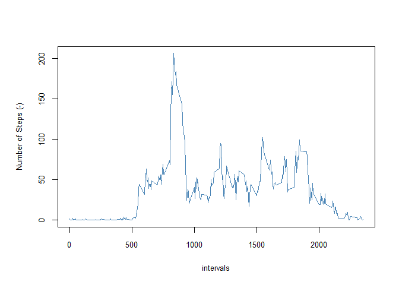

# Reproducible Research: Peer Assessment 1


## Loading and preprocessing the data

The following code read in the data from the current working directory, changes the 
*date* column data from a factor to a date format, and saves the date in two data.frame
variables: *mydataRaw* and *mydata*.


```r
        maindir <- "."
        setwd(maindir)
        mydataRaw <- read.csv("./activity.csv", sep=",", header = TRUE)
        mydataRaw$date <- as.Date(mydataRaw$date)
        mydata <- mydataRaw
        mydata$date <- format(as.Date(mydata$date), "%A %B %d")
```

## What is mean total number of steps taken per day?
First loads the two packages *plyr* and *dplyr* that we need for this analysis


```r
        library(plyr)
        library(dplyr)
```

```
## 
## Attaching package: 'dplyr'
## 
## The following objects are masked from 'package:plyr':
## 
##     arrange, count, desc, failwith, id, mutate, rename, summarise,
##     summarize
## 
## The following objects are masked from 'package:stats':
## 
##     filter, lag
## 
## The following objects are masked from 'package:base':
## 
##     intersect, setdiff, setequal, union
```

The daily average steps calculated above are displayed below. First the "NA" values 
are included in the data for the analysis.


```r
        myDailyMeanData <- ddply(select(mydata, -interval), .(date), colwise(mean))
        head(myDailyMeanData)
```

```
##                 date    steps
## 1 Friday November 02 36.80556
## 2 Friday November 09       NA
## 3 Friday November 16 18.89236
## 4 Friday November 23 73.59028
## 5 Friday November 30       NA
## 6  Friday October 05 46.15972
```


For this part of the assignment, the missing values in the dataset are ignored. Ignoriing the missing values in the dataset, the daily total steps are calculated as follows:

#### (1) Calculate the total number of steps taken per day


```r
        myDataClean <- na.omit(mydata) # removing na and nan  
        myDailyTStepsData <- ddply(select(myDataClean, -interval), .(date), colwise(sum))         
        head(myDailyTStepsData)
```

```
##                 date steps
## 1 Friday November 02 10600
## 2 Friday November 16  5441
## 3 Friday November 23 21194
## 4  Friday October 05 13294
## 5  Friday October 12 17382
## 6  Friday October 19 11829
```

#### (2) Histogram of the total number of steps taken each day


```r
        windows.options(width = 480, height = 480)
        par(cex.axis = 0.8, cex.lab = 0.8, cex.main = 1.2, cex.sub = 1)
        par(mar = c(5.1, 4.1, 4.1, 2.1), oma = c(0, 1, 1, 0))
        with(myDailyTStepsData, hist(steps, breaks = 15,
                                     main = "Total Number of Steps Taken Each Day", 
                                     xlab = "Daily total Number of Steps(-)", 
                                      col = "red"))
```

 

#### (3) Mean and median of the total number of steps taken per day
        

```r
        summary(myDailyTStepsData$steps)
```

```
##    Min. 1st Qu.  Median    Mean 3rd Qu.    Max. 
##      41    8841   10760   10770   13290   21190
```

  
## What is the average daily activity pattern?

#### (1) Make a time series plot (i.e. type = "l") of the 5-minute interval (x-axis) and the 
####     average number of steps taken, averaged across all days (y-axis)
        

```r
        windows.options(width = 480, height = 480)
        par(cex.axis = 0.8, cex.lab = 0.8, cex.main = 1.2, cex.sub = 0.8)
        par(mar = c(5.1, 4.1, 4.1, 2.1), oma = c(0, 1, 0, 0))
        mydata2 <- na.omit(mydata)
        with(mydata2, {plot(interval, steps, xlab = "", ylab = "Number of Steps (-)",  
                            type = "l", lty = 1, lwd = 1.5)})
        
        abline(h=mean(mydata2$steps),col=4,lty=1, lwd=3)
```

 

#### (2) Which 5-minute interval, on average across all the days in the dataset, contains the 
####     maximum number of steps?

```r
        library(magrittr)
        mydata2 %>% filter(mydata2$steps == max(mydata2$steps)) %>% print
```

```
##   steps                date interval
## 1   806 Tuesday November 27      615
```


## Imputing missing values

#### (1) Calculate and report the total number of missing values in the dataset


```r
        missingvaluesTotal <- sum(is.na(mydata))
        missingvaluesTotal
```

```
## [1] 2304
```


#### (2) Filling in all of the missing values in the dataset using mediam of the same day


```r
        library(plyr)
        mydataFd <- ddply(mydata,.(date),transform,steps=ifelse(is.na(steps),median(steps,na.rm=TRUE),steps))
```

#### (3) New dataset that is equal to the original dataset but with the missing data filled in 

```r
        head(mydataFd, n=5)
```

```
##   steps               date interval
## 1     0 Friday November 02        0
## 2     0 Friday November 02        5
## 3     0 Friday November 02       10
## 4     0 Friday November 02       15
## 5     0 Friday November 02       20
```
  
#### (4) Make a histogram of the total number of steps taken each day and Calculate and report the mean 
####     and median total number of steps taken per day. 


```r
        windows.options(width = 480, height = 480)
        par(cex.axis = 0.8, cex.lab = 0.8, cex.main = 1.2, cex.sub = 1)
        par(mar = c(5.1, 4.1, 4.1, 2.1), oma = c(0, 1, 1, 0))
        myDailyTStepsDataFd <- ddply(select(mydataFd, -interval), .(date), colwise(sum))
        with(myDailyTStepsDataFd, hist(steps, breaks = 15,
                                     main = "Total Number of Steps Taken Each Day", 
                                     xlab = "Daily total Number of Steps(-)", 
                                     col = "red"))
```

 


Do these values differ from the estimates from the first part of the assignment? 
What is the impact of imputing missing data on the estimates of the total daily number of steps?  
  
## Are there differences in activity patterns between weekdays and weekends?


#### (1) Create a new factor variable in the dataset with two levels - "weekday" and "weekend" indicating
####     whether a given date is a weekday or weekend day.


```r
        library(data.table)
```

```
## 
## Attaching package: 'data.table'
## 
## The following objects are masked from 'package:dplyr':
## 
##     between, last
```

```r
        myDT <- data.table(mydataRaw)
        myDT <- na.omit(myDT)
        setkey(myDT, date)
        myDT[, WDType := ifelse( weekdays(date) %in% c("Saturday", "Sunday"), "weekday", "weekend"), by=date]
```

#### (2) Make a panel plot containing a time series plot (i.e. type = "l") of the 5-minute interval 
####     (x-axis) and the average number of steps taken, averaged across all weekday days or weekend days
####     (y-axis). See the README file in the GitHub repository to see an example of what this plot should
####     look like using simulated data
        

```r
        library(lattice)
        myDTmean <- ddply(select(myDT,-date) , .(interval, WDType), colwise(mean))
        xyplot(steps ~ interval | WDType, data = myDTmean, layout = c(1, 2), type='l', col='blue')
```

 

